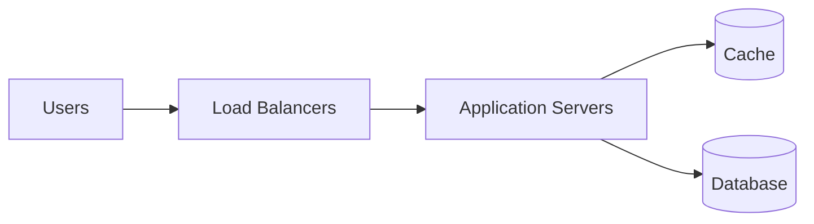

# Introduction
## What is System Design
- System design is the blueprint of a software system
- Defines system archtecture, components, infterfaces, and data flow
- Focuses on scalability, reliability, performance, and maintainability
- Establishes boundaries between services, databases, and users
- Converts business requirements into technical architecture
- Balances Functionality with operational realities

## Why is System Design Important?
- Scalability & Reliability - Ensures systems handle millions of users without failure
- Architectural Thinking - Goes beyond coding; involves trade-offs like CAP theorum, SQL vs. NoSQL
- Career Growth - Essential for becoming a senior engineer or architect
- Real-World Problem Solving - Helps building actual systems, not just clearing interviews
- Trade-offs & Decision Making - Balances scalability, cost, speed, and complexity
- Future-Proofing - Prevents bottlenecks and allows smooth evolution of software