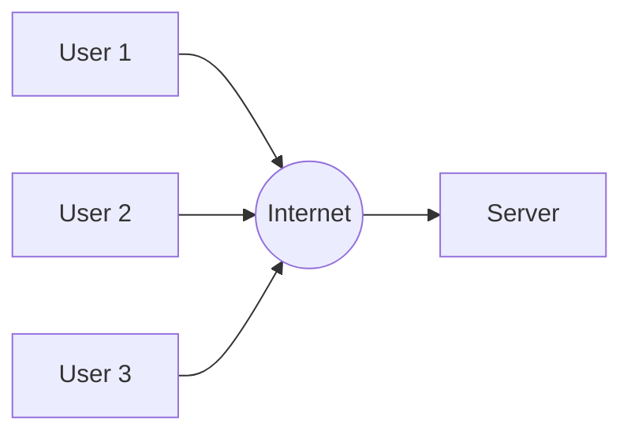

# Networking & Communication (System Design Fundamentals)
## Introduction to Networking in System Design

### Why Networking Matters in System Design
- Every system relies on data exchange between components
- Networking enables scalability, reliability, and performance
- Key areas where networking palys a curcial role:
    - Communication: Ensuring smooth data transfer between clients, servers, and databases
    - Load Balancing: Distributing traffic efficiently to prevent overload on a single server
    - Security: Protecting data from unauthorized access and cyber threats
    - Efficiency: Optimizing network performance to reduce latency and improve user experience

### How Networking impacts Large-Scale Systems;
- Helps handle millions of users concurrently
- Enables fast and efficient data exchange
- Reduces latency & improves stystem resilience
- Essential for cloud computing & distributed systems

## Understanding IP Addresses
