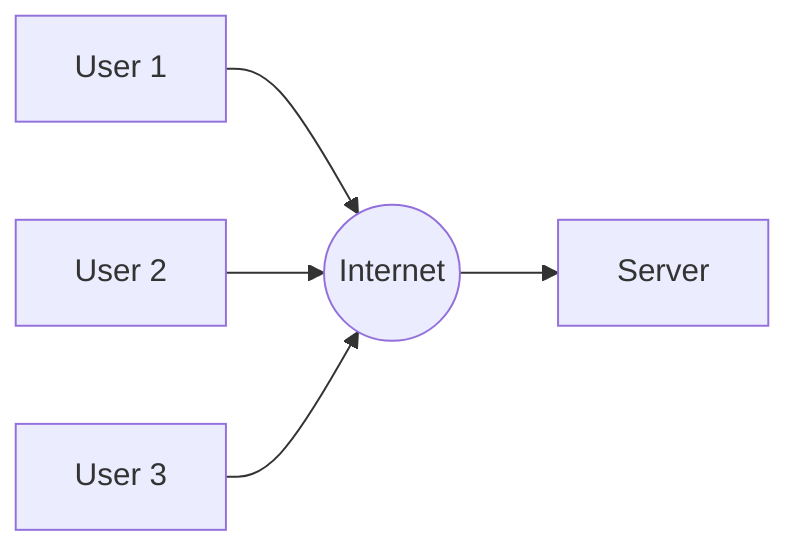
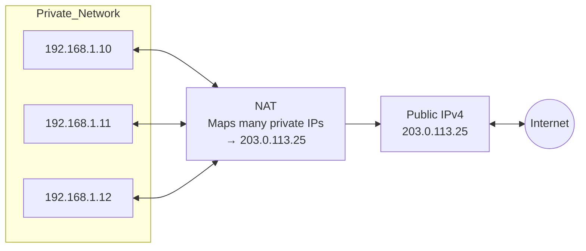
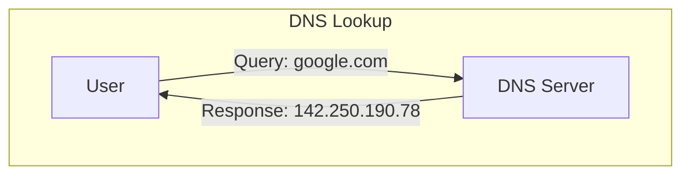

# Networking & Communication (System Design Fundamentals)
## Introduction to Networking in System Design

### Why Networking Matters in System Design
- Every system relies on data exchange between components
- Networking enables scalability, reliability, and performance
- Key areas where networking palys a curcial role:
    - Communication: Ensuring smooth data transfer between clients, servers, and databases
    - Load Balancing: Distributing traffic efficiently to prevent overload on a single server
    - Security: Protecting data from unauthorized access and cyber threats
    - Efficiency: Optimizing network performance to reduce latency and improve user experience

### How Networking impacts Large-Scale Systems;
- Helps handle millions of users concurrently
- Enables fast and efficient data exchange
- Reduces latency & improves stystem resilience
- Essential for cloud computing & distributed systems

## Understanding IP Addresses
- IP (Internet Protocol) addresses are unique numerical labels assigned to devices on a network
- They enable communication between different machines, servers, and services across internet
- Two primary versions;
    - IPv4
    - IPv6
- Two primary categories;
    - Public 
    - Private

### What is IPv4
- IPv4 (Internet Protocol Version 4) is the most widely used addressing system
- 32-bit address format (e.g., 192.168.1.1)
- Total addresses available: ~4.3 billion
- Performance: Limited due to NAT & fragmentation
- Uses: Traditional networking, web servers, and most current internet devices
- Challenges: Limited IPs, fragmentation, and security concerns

### What is IPv6
- IPv6 (Internet Protocoll Version 6) is the next-generation IP standard
- 128-bit address format - 2001:0db8:85a3:0000:0000:8a2e:0370:7334
- Total addresses available: 340 undecillion (virtually unlimited)
- Performance: More efficient routign & handling
- Designed for: IoT, mobile networks, and future scalability
- Key benefits: Larger address space, better security, and improved routing efficiency

> IPv6 is not an upgrade to IPv4; it is a redesign created to address IPv4's scaling limitations. Although IPv6 provides a better long-term solution, its adoption has been gradual due to  existing infrastructure, compatibility concerns, migration risks, and the operational costs involved in transitioning.

### Private vs. Public IPs

- Public IPs;
    - Assigned by ISPs (Internet Security Providers)
    - Used to communicate over the internet
    - Unique worldwide
    - Example: 192.203.23.45

- Private IPs;
    - Used within local networks (LANs, enterprises, homes)
    - Cannot be accessed directly from the internet
    - Example: 10.0.0.0 - 10.255.255.255

### Why Do We Need Private IPs?
- Conserves public IP addresses (IPv4 limitation)
- Enhances security (private IPs are not routable over the internet)
- Enables Network Address Transalation (NAT) to allow multiple devices to share a single public IP
- Common in corporate networks, data centers, and cloud environments

### The Role of IPs in System Design
- Scalability: Helps in designing distributed, multi-region, and cloud-based architectures
- Security: Enables firewall rules, VPNs, and private networking
- Load Balancing: Uses IP-based traffic distribution (e.g., Round-robin DNS, Anycast IPs)
- Cloud networking: Public, private, and hybrid cloud IP management (AWS, GCP, Azure)
- Microservices & Containers: Use internal private IPs for communication

> Abstraction layers are built on top of one another. Application depends on services, services depends on networks, and networks depends on addressing. 

## How DNS Works

