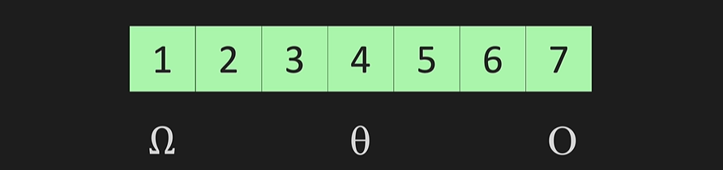
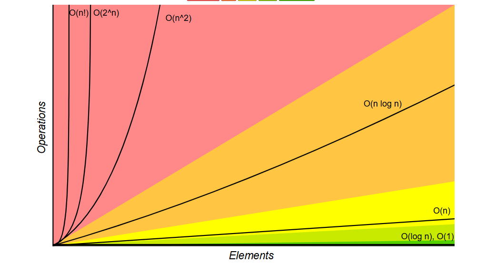
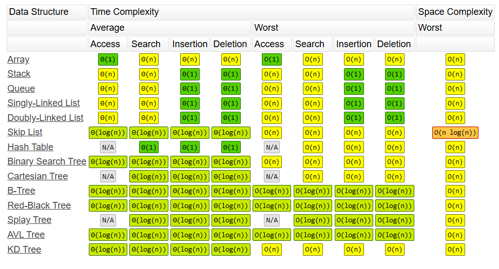
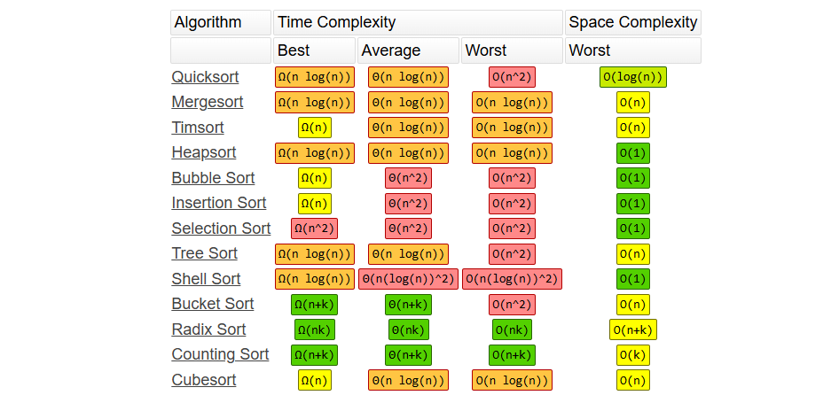

# Big O
When selecting a number from a list using a for loop, the best case is Ω (Omega), the average case is Θ (Theta), and the worst case is O (Big O)


## Time Complexity
Number of operations, not speed. Speed will differ as computing power, but number of operations stay consistent.




### O(n)
***n is the number of operations***
```
def print_items(n):
    for i in range(n):
        print(i)
```

#### First rule of simplifying, **Drop constants**
This is not O(2n), this is O(n)
```
def print_items(n):
    for i in range(n):
        print(i)

    for j in range(n):
        print(j)
```

***But, we can't do this if more than one input***
***Here we can't assume a == b, so O(a + b)***
```
def print_items(a, b):
    for i in range(a):
        print(i)
    
    for j in range(b):
        print(j)
```

### O(n^2)
***Nested loops***
```
def print_items(n):
    for i in range(n):
        for j in range(n):
            print(i, j)
```

***If we have more than one input, we can't assume a == b, so O(a * b)***
```
def print_items(a, b):
    for i in range(a):
        for j in range(b):
            print(a, b)
```

#### Second rule of simplifying, **Drop non-dominants**
This is not O(n^2 + n), this is O(n^2)
```
def print_items(n):
    for i in range(n):
        for j in range(n):
            print(i, j)

    for k in range(n):
        print(k)
```


### O(1)
***Constant time***
```
def add_items(n):
    return n + n 
```

### O(log n)
**O(log n)** means the number of steps grows slowly because the input is repeatedly divided (usually by 2) until it becomes 1.

log_b(n) = k  ⇒  b^k = n

Ex: log₂(8) = 3

## Space Complexity
Memory usage

